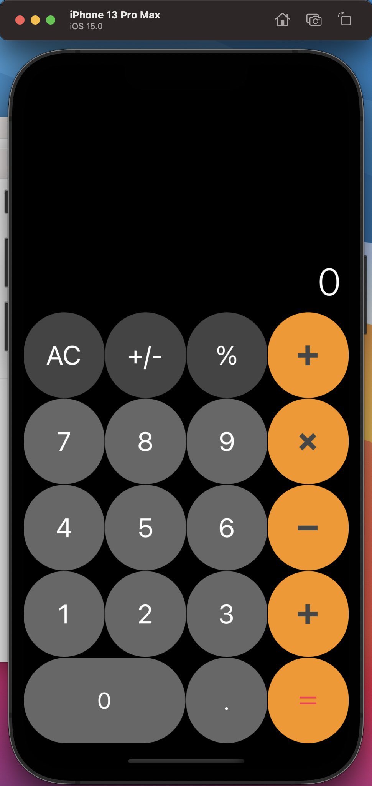
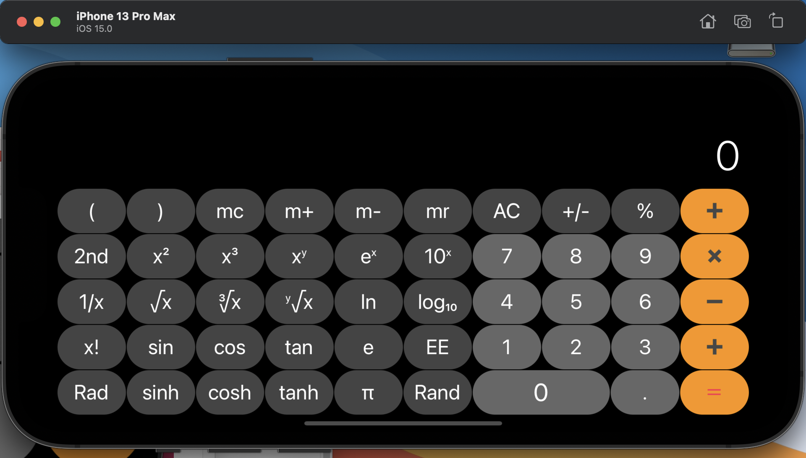
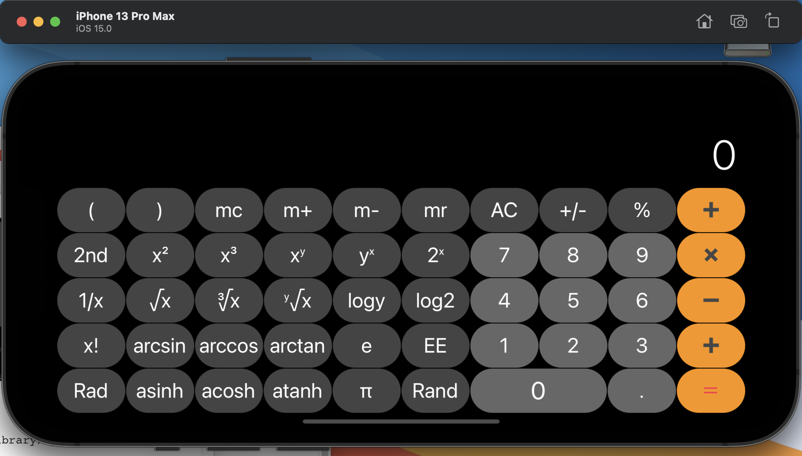

# IOSwork1 - 计算器

#### 环境：macOS BIG SUR 11.6

#### Xcode版本：Version 13.0 (13A233)

#### 模拟器：iphone13 pro max (ios15.0)

## 效果展示

#### 竖屏：

#### 横屏：

#### 

### 演示：B站 BV1wL411G7jf

### 开发历程记录

+ 刚开始先根据之前看视频的模糊知识大致绘出了一个界面，结果转换横竖屏的时候设置边界条件非常繁琐。后来采用了样例视频的方法将结果和按钮界面设置在两个view中，方便有效的解决了横竖屏按钮和结果界面的相对位置问题。
+ 后来想进行背景颜色等的设计，发现设置完底层view的背景后，上层stack view的背景缺并没改变，加上前面布局时的增加两个view的方法，让我对app的视图层次的概念有了更直观的印象。
+ 接下来遇到了一个让我困惑很久的问题——如何实现横竖屏的不同界面。之前的设置方法在横屏时不会出现界面错位的问题，但是缺没有实现横竖屏界面不同的功能（加上我也没有看PPT的文档）。首先我想到的就是`hidden`参数，在我之前的尝试中发现用这个参数可以实现按钮的隐藏，那不是只要代码里有个if-else判断横竖屏情况并设置按钮的hidden参数就好了？结果网上搜到的代码我都看不懂……然后使用vary for traits进行了 横竖屏的设置，但是运行成模拟器后却不能正常显示。直到后来看了老师的Cal例子才惊奇的发现，原来在main中就可以对hidden参数进行条件设置，并且加深了对sizeclass的理解（看文档还是重要哇）
+ 接下来就是苦力工实现各个按钮对应的功能了。之中对swift不熟悉写起来还是有难度的。最后也只实现了单步运算，中间遇到了Double计算误差我就直接使用暴力处理法解决了，最后写完才了解到高精度计算的方法（吕玉龙同学告诉我的）。对于非法表达式和溢出我就直接定义为了无穷大。

### 总结

总的来说这次作业难度还是有的，对swift的不熟悉（学习swift还是有点头疼，发现他有很多神奇的方法，让之前只会C++的选手感觉非常神奇），没好好看文档导致的对很多功能一头雾水。但是最后实现了界面类似的计算器后还是有挺大的成就感的（甚至想发给家长让他们玩玩）感觉选了这门课有学到很多，曹老师本人也很有意思😍😍😍，希望后续能继续做这些有趣的实验

